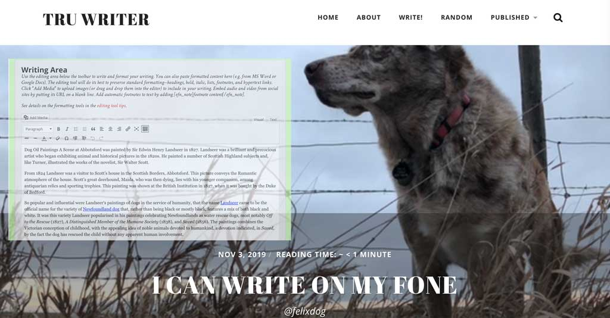
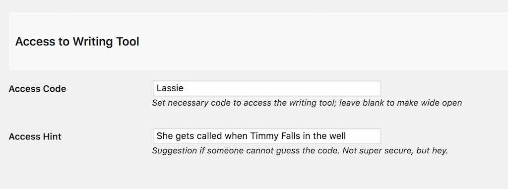
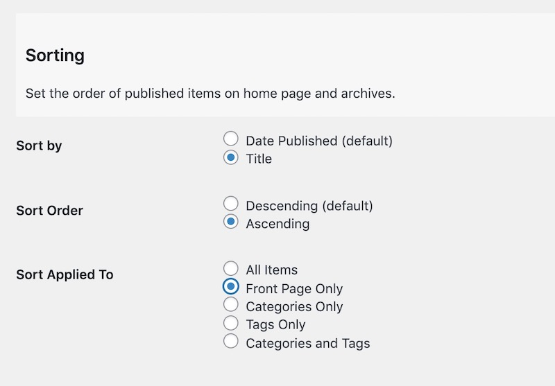
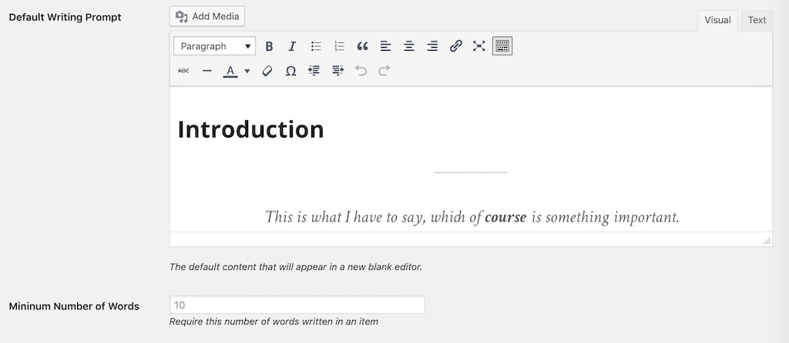
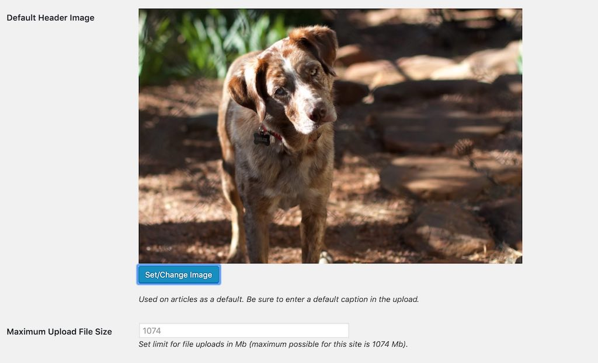
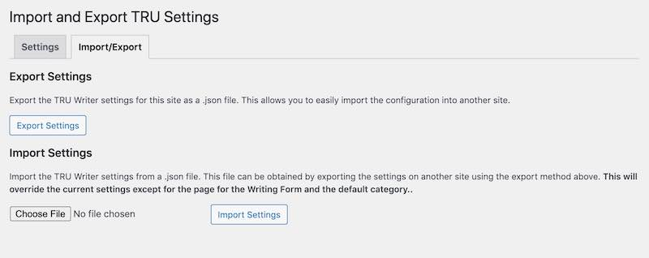
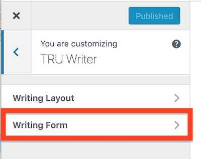
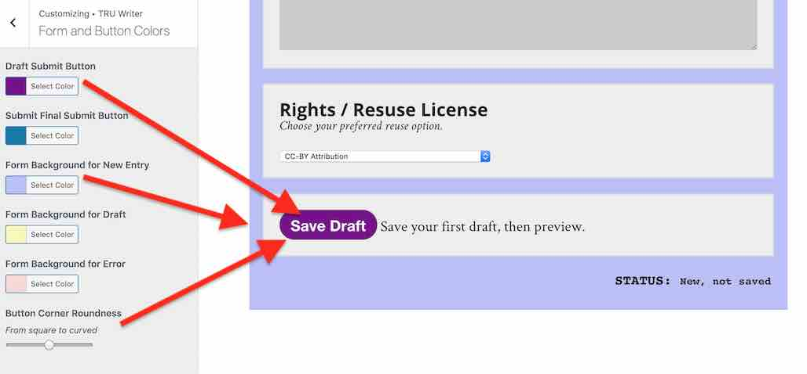
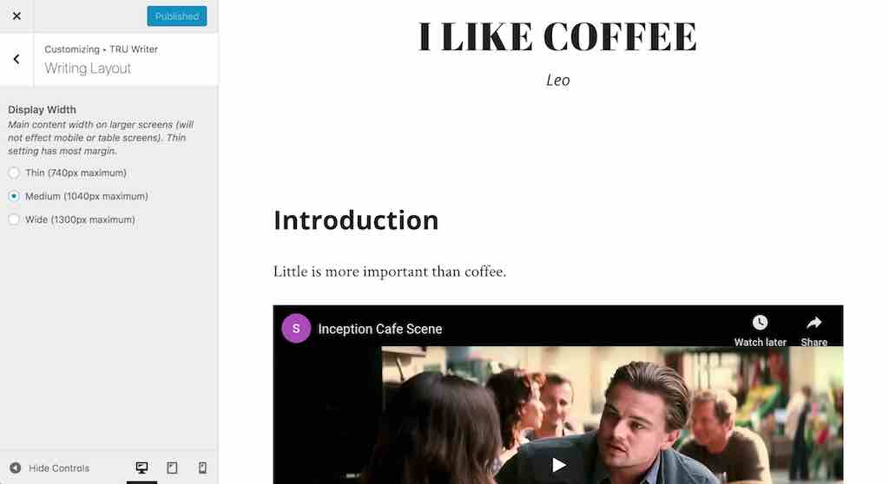

# TRU Writer Wordpress Theme
by Alan Levine http://cogdog.info/ or http://cogdogblog.com/

-----
*If this kind of stuff has any value to you, please consider supporting me so I can do more!*

 

----- 

## What is this?

This Wordpress Theme powers [TRU Writer](http://splot.ca/writer/); a site that allows people to publish their writing, including rich media content, without needing to login or understand the backend of Wordpress. 

Once installed, the TRU Writer theme powers sites for generating content online using an rich text editor interface. Writers can also  cut and paste into the editor from word-processing software such as MS Word or Google Docs, carrying forward most structural formatting (here's an example of a post [created by using the copy/paste function (cmd/ctrl + V) from a Word document](http://splot.ca/writer/2014/101). 

Because it requires no login or CMS knowledge, TRU writer is great for projects where multiple people are [contributing to classroom activities](https://biol420.opened.ca/) where many individuals [can publish content on the same site]((http://femedtech.net/), even as a means for [running an online journal](http://journal.arganee.world/), [anonymous exposés](http://refugeelearningstories.org/), or even [a conference proposal submission system](http://conf.owlteh.org/contributions/). 

It focuses on the *writing* rather than Wordpress (not that we do not love you, Wordpress!). The TRU Writer allows individuals to publish anonymously, or under an assumed name, or their own name, or whatever. It never requires personal information (entering email is an option that allows a writer to edit their content after publishing).

The TRU Writer Theme was developed along with  [TRU Collector](http://splot.ca/splots/the-comparator/),  [TRU Sounder](http://splot.ca/splots/tru-sounder/), [The Comparator](http://splot.ca/splots/the-comparator/), and the [Daily Blank](http://splot.ca/splots/the-daily-blank/) [while on a fellowship](http://cogdog.trubox.ca) at [Thompson Rivers University](http://tru.ca/)--that's why the "TRU" in the theme name.

## With Thanks

SPLOTs have no venture capital backers, no IPOs, no real funding at all. But they have been helped along by a few groups worth recognizing with an icon and a link.

The original TRU Writer was developed under a [Thompson Rivers University Open Learning Fellowship](http://cogdog.trubox.ca/) and further development was supported in part by a [Reclaim Hosting Fellowship](http://reclaimhosting.com), an [OpenETC grant](https://opened.ca), Coventry University's [Disruptive Media Learning Lab](https://dmll.org.uk/),  plus  ongoing support by [Patreon patrons](https://patreon.com/cogdog).

       

## Examples in Action 

Beyond [the demo site used as a pre-made import](https://lab.cogdogblog.com/writer/), some places you can see others putting the TRU Writer theme in action include:

* [30,000,000 ACA Stories](http://bones.cogdogblog.com/30million/) (archived)
* [Alan Levine’s Publications for a portfolio](http://cogdogpapers.trubox.ca/)
* [Amanda Notes](https://acoolidge.opened.ca/) 
* [Arganee Journal](http://journal.arganee.world/) open online journal for Networked Narratives and ResNetSem courses
* [BIOL 312 @ UNBC](https://biol312.opened.ca/) Molecular Cell Physiology (University of Northern British Columbia)
* [BIOL 420 @ UNBC](https://biol420.opened.ca/) Animal Behaviour (University of Northern British Columbia)
* [Book 20 - Working Title](http://72challenge.coventry.domains/blog20/) 72 Hour Challenge project at Coventry Univerity, Year 1 Media Production module Key Concepts in Media Production  
* [NRES 701 @ UNBC](https://nres701.opened.ca/) Natural Resources and Evironmental Studies Graduate Colloquia (University of Northern British Columbia)
* [BIOL 421 @ UNBC](https://biol421.opened.ca/) Insects, Fungi and Society (University of Northern British Columbia)
* [Comics and Mass Media](http://graphixia.ca/comicsandmassmedia) (Graphixia)
* [COVID-19 And LCC: Our Story in Words](https://livetogether.openlcc.net/covid19stories/) Lansing Community College
* [Community Performace Toolbox](http://communityperformancetoolbox.org/)
* [Ed Tech F20](https://fall20edtech.trubox.ca/) Thompson Rivers University
* [EDUHACK Wall](https://wall-it.eduhack.eu/)
* [ENGL 1110 Writer, TRU](http://engl1110writer.trubox.ca/) Thompson Rivers University English course
* [ENGL 4790 Writer, TRU](http://engl4790writer.trubox.ca/) Thompson Rivers University English course
* [English 1102.002: Reading Themes in Literature (Digital Culture)](http://digitalcultureslab.ca/hybrid1102/fall2016-classleads-002) Douglas College
* [ETUG Stories](https://etugwriter.opened.ca/) Edtech and  instructional design stories from the Educational Technology Users Group (BC)
* [Farm to School BC](http://trubox.farmtoschoolbc.ca/)
* [#femedtech Open Space](http://femedtech.net/)
* [Grinnellians in the Time of Coronavirus](https://resilience.sites.grinnell.edu/) Grinnell College
* [History 3010](https://hist3010.trubox.ca/) Thompson Rivers University
* [iTeach](https://iteach.csu.edu.au/) used by Charles Sturt University staff to share their learning and teaching practice
* [Keene State College Teaching Stories](http://cangialosi.kscopen.org/writer/)
* [Lee and Brenna's Class Blog](http://www.english2point0.ca/nationalistsuperhero/) Nationalist Superhero (Douglas College)
* [Learning on/with the Open Web](http://conf.owlteh.org/contributions/) uses TRU Writer for collecting conference event session submissions
* [Learning Parallism](https://edci335pod2parallelism.opened.ca/) A Interactive Learning Resource group project for EDCI 335 (University of Victoria)
* [L21C Lawyering in the 21st Century, TRU](http://l21c.trubox.ca/)  Thompson Rivers University Law course 
* [Media Buffs 2021](https://spring-2021.media.buffscreate.net/) ENVS 3032: Environment, Media, and Society, a course offered by the Environmental Studies Program at the University of Colorado, Boulder.
* [My TRU Writer](http://bsolivan.wescreates.wesleyan.edu/MyTruWriter/) Wesleyan University
* [OER In Other Languages](https://oloer.opened.ca/) Tannis Morgan
* [OWLTECH Stories](http://stories.owlteh.org/) Open Web For Learning & Teaching Expertise Hub -- a selection of accounts narrating how specific instances of the Open Web can be used for teaching and learning.
* [Open Education Challenge Collection](https://oecollection.opened.ca/) Responses to the [BCcampus OE Challenge Series](https://oechallenge.opened.ca/)
* [OpenMed Project Works Showcase](https://showcase.openmedproject.eu/)
* [Pandemic Whispers](http://whisper.arganee.world)
* [Prototype for Small Cities Imprint journal](http://smallcities.trubox.ca/)
* [Refugee Learning Stories](http://refugeelearningstories.org/)
* [Research Methodology in Education](http://lled500.trubox.ca/) (University of British Columbia)
* [Rethink Learning Design](https://rethinkldsplot.opened.ca/)
* [Salmon in the Tree: Biology 1210](https://biol1210.trubox.ca/) (Thompson Rivers University) is used by teams of "students researching and answering a current biological question using academic sources of information, where the questions have an evolutionary, ecological or diversity theme."
* [Open Experiments in SDGs](http://sdgs4learning.org/) activity by Jenni Hayman as "a space for sharing open educational resources (OER) related to the United Nations Sustainable Development Goals (SDGs)" 
* [Sociology Field Reports](https://soci1110.trubox.ca/)  Thompson Rivers University
* [Stories & Tales](http://mkr12.coventry.domains/tales) English Language and Culture Summer School at  Coventry University
* [Student Interdisciplinary Education Festival (IDE)](https://idefestival.opened.ca/) Student presentations for Camosun College School of Health & Human Services virtual conference
* [The Apocalypse in Film and Literature](http://engl3140.trubox.ca/) Thompson Rivers University English course
* [Travellers](https://travellers.trubox.ca/) Study abroad site at Thompson Rivers University

* [TRU Undergraduate Research Journal](http://undergradjournal.trubox.ca/) 
* [TRU Writer SPLOT demo site](http://splot.ca/writer/)
* [UDG Agora Comparte](http://udg.theagoraonline.net/comparte) (this version has a few more custom fields and is translated into Spanish)
* [What Works: Remote Teaching and Learning at Kenyon College](https://whatworks.kenyoncip.org/)
* [When I Needed Help](http://web.archive.org/web/20170925000738/http://whenineededhelp.com/) (WayBack Machine archive)
* [Writing on the Web Together](http://truwriter.uwbopenweb.com/)

And if you make a TRU Writer site, please please pretty please fork this repo to edit this Readme with a link to your new site or let me know via twitter [@cogdog](http://twitter.com/cogdog).

If you have problems, feature suggestions, small bags of gold coin for me, please [contact me via the issues area](https://github.com/cogdog/truwriter/issues) on this repo.

Note that TRU Writer is a child theme based on [the free and elegant Radcliffe theme by Anders Noren](https://wordpress.org/themes/radcliffe). Install this theme first from within the Wordpress Dashboard under **Appearance** -- **Themes** searching on `Radcliffe`. Just install it, no need to activate.

## Installing TRU Writer

Using this theme requires a self-hosted--or institutionally hosted (lucky you)-- Wordpress site (the kind that you download from [wordpress.org](http://www.wordpress.org). You cannot use this theme on the free "wordpress.com" site unless you have a business plan. Maybe check out [Reclaim Hosting](https://reclaimhosting.com/) if you need to set up your own hosting space. 

The TRU Writer is a child theme based on [the free and elegant Radcliffe theme by Anders Noren](https://wordpress.org/themes/radcliffe). Install this theme first from within the Wordpress Dashboard under **Appearance** -- **Themes** searching on `Radcliffe`.

### Installing TRU Writer From Scratch

You can download a ZIP file of this theme via the green **Code*" button above (use the Download Zip option). 

The zip can be uploaded directly to your site via **Themes** in the Wordpress dashboard, then **Add Theme** and finally **Upload Theme**. If you run into size upload limits or just prefer going old school like me, unzip the package and ftp the entire folder into your `wp-content/themes` directory.

To get the TRU Writer working all you need to do is activate the "TRU Writer" theme when it appears in the Wordpress dashboard under **Appearance** --> **Themes**.  

### Updating the TRU Writer Theme (manually)

As of WordPress version 5.5, themes uploaded as .ZIP files can now be updated the same way you installed it. Just download the newest version, and update it by going to **Themes** in the Wordpress dashboard, then **Add Theme** and finally **Upload Theme**. You will be asked to confirm updating the theme with the newer version.  

### Installing TRU Writer in One Click with WP Pusher (get automatic updates!)

To have your site stay up to date automatically, I recommend trying the [WP Pusher plugin](https://wppusher.com/) which makes it easier to install themes and plugins that are published in GitHub. It takes a few steps to set up, but it's a thing of beauty when done.

To use WP-Pusher you will need to have or create an account on [GitHub](https://github.com/) (free). Log in. 

Next [download WP Pusher plugin](https://wppusher.com/download) as a ZIP file. From the plugins area of your Wordpress dashboard, click the **Upload Plugin** button, select that zip file to upload, and activate the plugin.

Then click the **WP Pusher** option in your Wordpress Dashboard, and then click the **GitHub** tab. Next click the **Obtain a GitHub Token** button to get an authentication token. Copy the one that is generated, paste into the field for it, and finally, click **Save GitHub** Token.

Now you are ready to install TRU Writer! 

Look under **WP Pusher** for **Install Theme**. In the form that appears, under **Theme Repository**, enter `cogdog/truwriter`. Also check the option for **Push-to-Deploy** (this will automatically update your site when the theme is updated) finally, click **Install Theme**.

Woah Neo?

Not only does this install the theme without any messy download/uploads, each time I update the theme on GitHub, your site will be automatically updated to the newest version. 

### Installing in One Click From Reclaim Hosting (get automatic updates!)

If you are wise enough to host your web sites at [Reclaim Hosting](http://reclaimhosting.com/) you have the option of installing a fully functioning site with this theme ([a copy of the demo site](http://lab.cogdogblog.com/writer/)) including recommended plugins, configured settings and sample content, all done  in one click. *But wait there is more!* With this method of installing your site, future updates to the theme are automatically added to your site (though not as frequently as the WP Pusher method).

In your cpanel, under **Applications** go to **All Applications**. This theme is available listed under Fratured Applications; just install from there.

*Note that unlike other WordPress installs, this one will not preserve your username/password, so be sure to save that information.* When it's done, log into your new site and start making it your own. 

## Inserting Demo Content

If you want a site that is not completely empty, after setting up with WP-Pusher or from scratch, you can import all the content set up on the [public demo site](https://lab.cogdogblog.com/writer). 

Install all content by [downloading the WordPress export for that site](https://github.com/cogdog/truwriter/blob/master/data/truwriter.xml).  Running the WordPress Importer (under **Tools** -- **Import**) and upload that file when prompted.

You can also get a copy of the Widgets used on that site too. First intall/activate the [Widget Importer & Exporter plugin](https://wordpress.org/plugins/widget-importer-exporter/). Download the [Writer Widgets data file](https://github.com/cogdog/truwriter/blob/master/data/writer-widgets.wie). Look under the **Tools** menu for **Widget Importer & Exporter** and use the Import Widgets section to upload the data file. Boom! You got my widgets.

## Troubleshooting

If you are updating a site built with a previous version of the theme and something wonky happens after an update, try the following:

* Don't panic!
* Go to Settings -&gt; Permalinks, and just click **Save**. Some errors are related to the way URLs are re-written in WordPress.
* Go to Appearances and change the theme to any other theme, then change it back to TRU Writer. There are some things the theme does on activation that can clear some issues with links not working.
* Go to the TRU Writer Options and click **Save** as new option values may need a reset
* Close down the computer, go out for a walk. Fresh air works wonders.
* If all that fails, [report an issue](https://github.com/cogdog/truwriter/issues) with as much detail that describes the situation.

## Setting Up TRU Writer

Now that you've installed TRU Writer and can see the barebones theme staring back at you or maybe dome cheesy demo content. It is not very interesting. Yet. Get rid of any "Hello World" posts, say bye bye. Set your TRU Theme Options (see below). Set up a menu. Try using the Write page to create some initial content. Poke around the Customizer settings. Fiddle with your footer widgets.

### Recommended Plugins for TRU Writer

While your doing all that uploading, you should know that this theme uses the [Reading Time WP plugin](https://wordpress.org/plugins/reading-time-wp/) to insert those commonplace estimates of reading time -- blame [Medium](http://www.medium.com) if you hate knowing how long a post might take to read.

### Page Setup

This theme has one special page for your writing form that must be created; associated with a specific template that provides it's functionality. Activating the theme *should* create the page for you when the theme is activated, but if not, create them as described below. You can edit the content of the **Write** page to customize the welcome seen by writers on your site.

If the theme does not do so automatically (and it should) create this Wordpress **Page**. 

* **Write** -- The page that provides the writing form, see [http://splot.ca/writer/write](http://splot.ca/writer/write).  Whatever you include in the body (not required) is added to the top of the form, maybe for extra instructions.e.g. for a site at `http://coolest.site.org/` the page can be published at `http://coolest.site.org/writing` When you create a Writing Form page, under **Page Atributes**, select the Template named `Writing Pad`

### Set Out Your Menus

The default menus are not what you want Wordpress will generate one based on all Pages set up.

In Wordpress Dashboard go to Appearance -&gt; Menus. Create a new menu, and check the location box for "Primary". A typical TRu Writer menu might have an "About Page", the Write page (the form for writing), maybe a Random link (your site URL followed by `/random`), and a set of dropdowns to see pages by category. Here is one example for the site http://splot.ca/Writer

You can of course, create any menu structure that works for your site- but don't use the default! And hey, if you're being all fancy and don't check the "Primary" box above, remember to go into the "Manage Menus" tab and change it from the default menu to the new awesome menu you just created or all you'll see is the default menu popping up again and again and that will be frustrating.  

### Theme Options and Settings
Upon activation the theme will set up a **TRU Writer Options** link that appears in the black admin bar at the top of your Wordpress Dashboard interface (when logged in), and in the "Appearance" tab on your Wordpress Dashboard. 

Click **TRU Writer Options** to see or change the settings outlined below. 

In the TRU Writer Theme, traditional "posts" in Wordpress are renamed "writings," but they still have all the attributes of garden variety Wordpress blog posts. Yum.

#### Access Options

Leave this field blank if you want any visitor to be able to access the writing form on your TRU Writer site. If that's too open for you, add a code and give it a hint. If you want a quick workaround here, make the site less accessible by not having any links in the homepage menu bar that go to the editor page--no link to the "writer" page, the harder it is to find the editor and post something.  

If you want to require users to enter an access code (a very weak password), just enter it in the space provided. Any requests to access the editor and write a post will be sent to a front-page where a writer must enter the passcode. As an example, we have "Lassie" and an equally difficult hint. If you enter in "Lassie," you can see the editor and begin the process of writing a post--but don't actually do that; we haven't set everything up yet! This is a hypothetical situation. For now, decide if you want a passcode. If you do, put it in, with a hint. If you don't, moving on!

The TRU Writer is a moderated publishing theme. And "moderated" means that when a writer submits something, it is not  immediately visible to the world. Instead, unless you set it otherwise (more on that below), when a writer submits a post (or "writing" as above) they are automatically set as drafts with a  *Pending Approval* status. You'll get notifications that a submissions has been made to the Email address you enter in the "Notifications Email" option. 

In order to make a post (or "writing" as above) visible, a user with the permission status of "Editor" or "Administrator" needs to change the status of the "pending approval" writing to "published (or ignore an "Editor" or "Administrator" could just ignore it forever, such power is theirs).

#### Special Page Setup

Use this area to assign the WordPress Page to be used for the writing form. With version 1.8 of TRU Writer, you can now use any name you want for the URL (previously these were forced to be `write` -- this is no longer required.

If no Page is found with the correct template, you will see a prompt to create one. If the Page is found (and there might even be more than one, you can select the one you want used for each special page.

Only one special page is needed now (there was at one time four!)

#### Publish Settings

You can also choose the "status for new writings" as "publish immediately" and there are no checks and balances--the writing goes right up and is publicly visible immediately. Immediate gratification goes a long way. Note though, that because of the hollow tunnel this might create, this option works best with an access code as described above in place--right Lassie!?

Check the **Allow Comments** box to add a standard blog comment field at the bottom of all published pieces. 

### Sort Options

The default settings are for typical blogs where newest content is displayed first. The sort options allow you to change that across the site- the home page and category/tag archives, as well as making that change only in certain areas.

**Date Published** is the default option, the order is **Descending**, or newest first, change to **Ascending** to have oldest items appear first. 

Change the sort otder to **Title** to... yes... sort items alphabetically by each item's title.  Use **Ascending** for alphabetical order (A-Z) or **Descending** to reverse (Z-A).

Use the **Sort Applies To** option to specify where the alternative sorting is applied (for example, just on tags archive, or just the home page).

#### Writing Form Settings

Enter the **Default Writing Prompt** field to pre-populate the field that visitors write use to compose their work. You can provide a prompt or set up a structure. The editor is now full rich text enabled (including images).

You can also set a minimum number of words required for publishing.

Most uses will ask visitors to upload an image to use as a header/featured image. Using the option for **Allow Uploads of Header Images** this can be required (default), optional, or not used. If heade images are not used, all archive/front views will have a simple grey background instead of an image. 

Under **Default Header Image** click **Set/Change Image** to open the Wordpress media editor to choose a default media header image. Drop an image that you wish to be used as a default one if a writer does not include one of their own. The `640 x 300` dimensions are a minimum size, and represent a reasonable aspect ratio for a header image. Larger is better; and the image will be cropped along the middle of the image.

You can now also set a limit for the file size upload.

Before choosing the image, be sure to add a caption (we suggest a creative commons license!) as this is what is used to display atop the image when published. Attribute and model attribution! FTW!

Once selected you will see a preview of your default image. Isn't Felix a nice looking dog?

Note that you can set a maximum size for uploaded images.

Also, you can now use **Use caption field for uploaded header images** to make captions for attribution of images required (default), optional, or not used on the form.

Disable **Show the categories menu on writing form and display** if you do not want writers or readers to use/see categories.

If you have not set up any categories, the **Default Category for New Writing** menu will not do much. You might want to save your options and go edit your **Writing Categories**. On activation the TRU Writer will pre-create two categories it uses to organize what is submitted and published.

The `In Progress` category is where all submitted writings go if they need approval. Final Published items have their own ... `Published` category (big surprise there, eh?). If you want to give your writers a choice of categories to place their work, make sure any categories you create have `Published` as a parent.

So we suggest making a few pre-set categories for a new site. As an Administrator you can always add new ones at any time. Any text you add as a description will be included on the writing form.

Disable **Show the tags entry on writing form and single items displays?** if you do not want writers or readers to use/see tags. Likewise use **Show the footer entry field on the writing form?** to use/disable the footer field writers can append to their works.

Enabling the email fields creates the option for users of your site to provide an address if they wish to have a special link sent to them that allows for post-publishing edits. (or be able to request one when published).

As an option you can enter a comma-separated list of domains to restruct the email addresses entered (e.g. if you wish students to use an school provided email address).

The **Extra Information Field** represents a place for them to add a message that is not part of the final published item, but that the administrator or editor might need to know, or might have requested. Perhaps if you are using this theme to host multiple sections of a class or course of study, you might want to populate the prompt for this field with something like "Include your name and course section" or, "name the dog that best represents you".

These end up in a **Custom Field** named "wEditorNotes," which you can view when editing the post in order to publish it (not the "quick edit"; the full monty "edit" please). You will need to open the Screen Options toggle at the top of the Wordpress Dashboard interface and click the box that makes the Custom Fields available. The information is also included in the notification emails announcing a new writing in need of approval.

#### Admin Settings

Enter in **Notification Emails** any email addresses who should be notified if new submissions; you have multiple ones if you separate them by a comma. Or leave blank if you never want to know what's going on in your site.

#### Twitter Settings

You can now choose to disable the Tweet This button on published items In enabled, you can enter one or more hashtags to be used when a published item is shared via the **Tweet This** button. Do not include "#" and separate multiple ones with commas

#### Estimated Reading Time Plugin
This plugin is optional, if installed and activated, it will add to all published works an estimate of the reading time based on a crude formula. If it is not installed, you will see the notes shown above. This plugin is available in the Wordpress repository, so it is an easy install.

#### Creative Commons / Rights Settings

Creative Commons licenses or other usage rights (including copyright) can be attached to all works published on your site. Choose **Apply one license to all challenges** to place the same license on all works (a notice will be displayed on the writing form).

Or you can set the option to **Enable users to choose license** which places the same menu on the writing form so users can choose a license (or set to All Rights Reserved).

#### Import / Export TRU Writer Settings

The TRU Writer Options now features a tab with tools to export a sites settings as a JSON file than can be imported to another TRU Writer site. The only settings not transferred is the assigned Writer Page and the default Category (I expect these would be set up in a site clone?)

 

Some mild checks are done on importing a JSON file- errors will be generated if it is the wrong file type and if it was not generated by a TRU Writer site.

## Customize the Writing Form

You can customize the field labels and the descriptions of the form where people submit new pieces of writing. From anywhere viewing your site select **Writing Form** from the **Customize** menu. This opens the Customizer with the form page open.

Look for a special section just below **Site Identity** to open:

Then from this pane, open "Writing Form Prompts" tab

And then you will see a series of fields to edit for all form field elements. 

For each, you can edit the title/label of the field and the prompt that appears below. As you type in the customizer fields on the left, you will see a live preview on the right.

### Customize the Form and Button Colors

On your site navigate to the writer form, and activate the Wordpress Customizer from the admin bar. 

In the Customizer, under TRU Writer, look for a pane for **Form and Button Colors**:

Use these settings to change the colors of the two buttons used on the Writing Form (one to update/submit drafts, the other for the final submission. There are also controls to modify the background colors on the form- for a new entry, for one that hs in draft, and a warning for form errors. 

Finally, you can modify the roundness of buttons. Why? Because we can

### Customize the Published Layout

You can  also customize the content layout. On your site navigate to any content post or page, and activate the Wordpress Customizer from the admin bar. From the **TRU Writer** pane, open **Published Layout**. 

Here you can choose from the Thin or Medium layout widths (Wide will only affect very large screens).

A small thing, but a corny heading of "SO IT WAS WRITTEN" was hardwired into the single post template; this is now something that can be changed in the Customizer: 

## Shortcodes

### Display All Tags

The basic use is just

`[taglist]`

which displays all tags used in alphabetical order, each linked to an archive, and the number of times used listed.

Optional parameters include:

* `number=10` limit to ten tags (default=0 or all tags)
* `show_count=false` hides the display of the number of times tag used (default=true)
* `mincount=2` will only show tags used 2 or more times (default=1)
* `orderby="count"` to order results by the number of times tag used (default="name")
* `order="DESC"` to list in descending order (default="ASC")
* `hide_empty=0` to list tags not used (default=1)

In use, this will display the 20 most used tags

`[taglist number=20 orderby="count" order="DESC"]`

### Count of Published items

Use [splotcount] to display the number of all published items

## Optional / Suggested Add-ons

### OpenGraph Tags for Social Media Sharing

If you would like Twitter Cards and Facebook shares to use the main images and provide a more complete display, install, activate, and configure a plugin like [Open Graph and Twitter Card Tags](https://wordpress.org/plugins/wonderm00ns-simple-facebook-open-graph-tags/). This adds the special [open graph tags](https://ogp.me/) to your site's pages to enable better social media share previews.

### Manage TinyMCE Editor

If you want to customize/re-arrange the buttons and controls on the rich text editor used by writers on your site, install [TinyMCE Advanced](https://wordpress.org/plugins/tinymce-advanced/). There is [a file in the theme](includes/tinymce-advanced-settings.txt)  with the typical settings for this plugin I use when I set up these sites.

You can copy and paste from that .txt file into the import field of the settings for TinyMCE Advanced (it's a small chunk of json).

## Relatively Cool New Features & Updates

* **Tag List** Shortcode provides a way to list all tags used, set the sorting, and optionally limit number of tags shown

* **Sort Options** TRU Options provides settings to change the sorting of published items to be by date or alphabetical, and can be ascending or descending. There are also settings to apply it only to the home page, or just to tag and/or category archives. Also updated template to properly display archive headings and descriptions (for tag and category archives)

* **Import/Export Settings** The TRU Options interface now features tab or exporting a sites SPLOT settings as a JSON file that can be imported to another site. The documentation tab is gone in lieu of a link to GitHub and mention of a future new documentation site. Hah.

* **Tag Suggestions** Tags entry field provides autocomplete suggestions (or at least is working now). 

**Alternative Text For Header Images** Optional field added that should be used by all! Provide an alternative text for an image for better web accessibility.

**Header Image and Caption Options** New theme options to make thes fields required (default), optional, or not used. Sometimes people don't want images atop their writing or used on archive listings.

**Inline Image Uploader** The writing form has a new button for inserting images in the body of text (previously done via the secret login) now all done without using the WordPress media library. Images can be selected or drag/dropped to the control, and are uploaded behind the scenes to the site. Also the Customizer now has controls for changing the colors of the Writing Form background colors and buttons, even for making the buttons *round*. Woah, Neo. Does anyone read this?

**No More Secret User** This theme no longer requires setting up of a special authoring account, and there is no secret logging in behind the scenes. The writing form has a new drag and drop upload interface for featured image (and a new option for limiting the file size if uploads). The theme has also been simplified by not having a separate Welcome Desk Page for handing the access codes, everything is managed in the Writing Pad template.

**Options for Special Pages**  No longer are pages for the Welcome Desk (where access codes are entered) and Writer form required to have a set URL; you can create any Page desired for these functions, and set them as the active ones via the theme options. Version 2.0 does some better set up for defaults.

**Better Front End Editor**  Reduced reliance on special pages. The links to the random entry and the one use to get the edit link are no longer needed, and are handle now in the code. These pages should be deleted from your site. On an update to version 1.7 or later, you might have to go to **Settings** - **Permalinks** and just click save to update the url rules. Also the method for using the special link to edit an entry is now done in a single click. Much better!

**Better Layout and Media Support** Customizer options for choosing a this or wider content layout.

Media can also be uploaded by dragging and dropping files onto the editing area. Inside the code the long `functions.php` is now broken up into more manageable size includes. Small display improvements on single item views. The licensing options updated to be driven by functions, and expanded to include public domain and yikes, even copyright.

**Options for Email Address** the form field for users entering email addresses can be hidden if not used (this as well will remove and past "request edit link" from published sites. In addition, a new admin option is added to restruct the email addresses allowed to a list of domains.

**Under the Hood** Fixed bug where choosing no comments hid the Reading Time display, changed options editor for default content to be rich text editor, enabled drag and drop media uploading for front page writing form. Also, URLs that WordPress can autoembed (e.g. YouTube, Twitter, Giphy) will now do so automatically in the editor.

**Theme Option to Remove Tweet This Button** to enable better GDPR compliance.

**Customize the Writing Form Instructions**  You can now modify all form field labels and descriptions / prompts for the entry fields.

**Default Menu** On new installs where no menus are defined, the theme generates a simple menu rather than listing all pages 

**Reading Time Plugin** The [Estimated Reading Time Plugin](https://wordpress.org/plugins/estimated-post-reading-time/) is no longer available, so the theme now uses [Reading Time WP](https://wordpress.org/plugins/reading-time-wp/).

**Separate CSS / Functions for Custom Installs** Fixed quote bug for captions, and changed writing form so it only displays featured image and intro text for first view of the form (so you can add really long instructions).

**Tweet This Button** There is a new option so you can have your own hashtags added when someone tweets a published item. Also, twitter card meta data has been added so these tweets have the extended card display that shows the featured image, the site's title, and an excerpt from the item-- example https://twitter.com/cogdog/status/822656183769198593

**Options Refreshed, Auto Page Creation, Better Reading Time Display** Recoded the theme options so documentation in its own tab. When he theme is activated now, the necessary pages will be created automagically. And if the Estimated reading time plugin is not activated, nothing will be displayed where it normally displays.

**Provide an Email, Edit your Work Later** A major limitation of the first versions was that authors had no ability to edit their work after publishing (that's what happens when you don't have logins). As of November 2015, authors have a new field where they can enter an email address- if this is provided (it is not required), they will receive via email a special coded URL they can use at anytime to modify their work.

When published, any writing with an email is published with a `Get Edit Link` button at the bottom which will resend the link to the email associated with it.

**Admins Can Get Edit Link for Anybody** Even if the author does not provide an email address, in the Wordpress Dashboard interface, editors and admins can click and copy an edit like they can provide directly to a writer (this is added as a side metabox).

